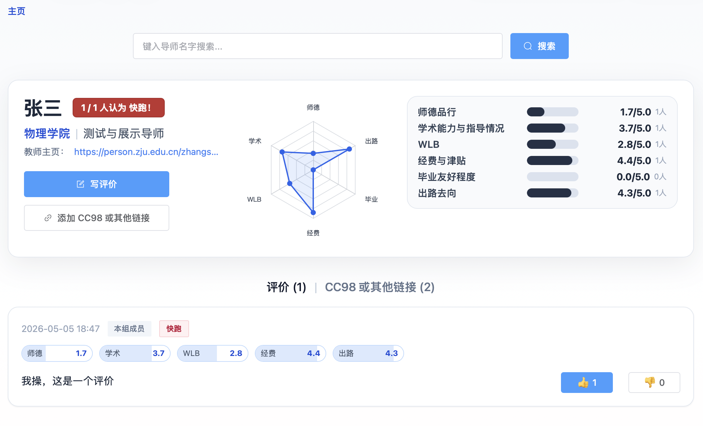
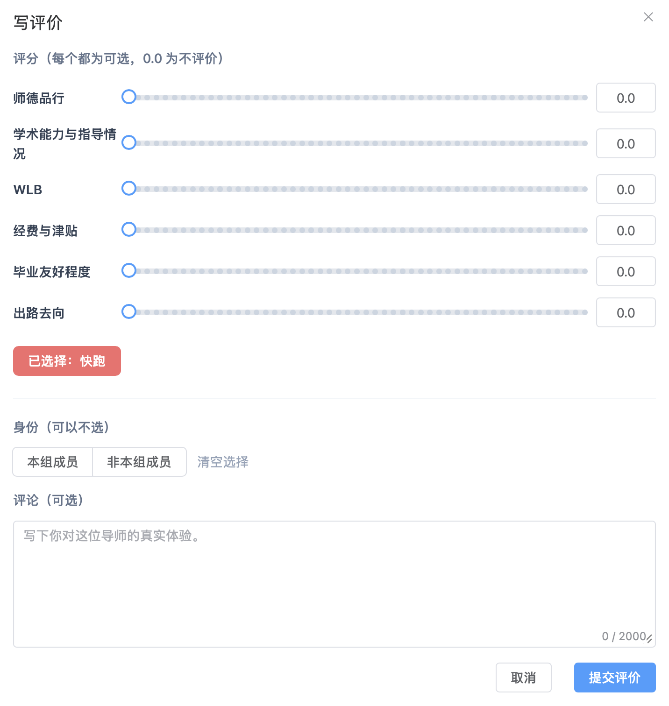

# 针对研究生选导师的浙大导师评价网站

这是一个面向研究生选导师的导师评价撰写与查询网站：[**zjumentors.com**](https://zjumentors.com)。

这个网站的评价服务于**读研、选导师、避坑和信息互助**。除了研究生选导之外，也涉及对导师本科生科研情况的评价。

---

## 网站特点

概括：

1. 全开源，从源代码到**完整评价数据**全部可下载
2. 完全的匿名评价，保证评价分享者的身份安全
3. 每一个评价指标与评语都是可选的，只需要写知道的部分。还有专门的“快跑”标记
4. 可以在导师页面添加与浏览本人相关的 CC98 与其他平台链接，丰富信息源

下面细说：

### 1. 数据全开源可下载，避免平台变质，也能通过分布式加强信息安全

网站支持下载**已有的全站数据**和所有相关的爬虫、数据整理、网站前后端代码：

[https://github.com/LiuyangSong-ZJU/ZJU-mentor/releases/tag/data-latest](https://github.com/LiuyangSong-ZJU/ZJU-mentor/releases/tag/data-latest)

通过开源数据可以建立完整网站。这么做有两个原因。

一方面，过去有一些评价类网站，前期依靠用户免费贡献内容，等数据量大了之后就开始收费或限制访问。这样窃取了评价者的付出变成了平台自己的利益，也会让认真写评价的人感到寒心。所以我希望从一开始就把数据开放出来，保证数据的安全性，保证大家的付出不会因为管理者的变质而被浪费被消费。

GPT 为我写的一句话很好：**大家贡献的信息，不应该只被某一个网站或管理者控制。**

另一方面，导师评价这类网站未来可能会遇到各种压力和铁拳。像 Anna's Archive 这样的模式给了我启发：分布式。对付（可能到来的）对传播的阻碍的最好方法就是分布式。让许多人拥有全部的数据、拥有分发与可能的重建的完全能力。这样即使以后网站暂时无法访问或者完全没了，评价信息也可以被已经下载过数据的人通过文件的形式分享，甚至可以重建网站。这样做也可以让评价者的付出不因为网站的不测失去传播机会、被浪费。

GPT 金句：我希望这个网站不是一个只能依赖我个人维护的东西，而是一个任何有兴趣的人都可以查看、改进、复制、重建的项目。

---

### 2. 完全匿名评价，不要求提供身份信息

网站不要求提供身份信息。目前也不会按照评论数量、热度之类的指标进行排名，避免把导师评价做成“流量榜”或者“挂人榜”。对点查才能查到导师的评价。这样一方面也降低了写差评对个人身份安全的风险，不会因为差评把认识的导师刷到人人都看得到的主页榜首。理想的使用方式是：你想了解某位老师，就直接搜索这位老师；你愿意评价某位老师，就进入对应页面写下你知道的内容。

匿名也会带来评价真实性的问题，但是在这两者的取舍上，还是身份安全更重要。大部分中肯的评价可以抵消不实评价的影响；**更重要的是，对每个评论都可以点赞与点踩，即使不发表评论，也可以通过这种方式抵制不实信息与赞同好的评论。**

---

### 3. 所有评价项与评语撰写都是选填

网站里所有的评价项与评语都是可选项，可以只对任何一点评分或单独写评语，不清楚的不用勉强说。这么做一方面是希望可以让每一点被了解的信息都可以被参考，**让每一条信息发挥帮助作用，欢迎任何一点评价，哪怕只知道一点点也可以来打分或写评语**；另一方面也可以不用勉强评分或写不清楚的东西，避免评价偏差。

还有一个点：在评价时可以选择“快跑”，即认为完全不推荐在该导师处做研究生。每条评论是否认为“快跑”会显示出来，一个导师被认为“快跑”的比例也会显示在个人页面顶端。我觉得这个很有趣😁。

---

### 4. 可以添加 CC98 或其他平台的相关链接

如果你知道 CC98 或其他平台上有相关帖子和讨论，也可以把链接添加到老师页面的专门区域。**很多 98 的帖子尤其是避雷帖碍于现实因素没写人名，只要知道说的是谁就可以过来链接起来（这也能让那些帖子更发挥价值）。**

反过来，大家也可以通过这个网站更方便地找到 CC98 等平台上关于特定导师的讨论。

---

## 为什么想做这个网站？

我自己在本科和正在进行的研究生阶段，非常强烈地感觉到选择导师对个人发展、心理健康、人生路径的影响之大。往小了说，这与研究生几年的生活幸福程度也有非常强的关联。一个好导师可以在这些方面带来益处，一个坏导师可以毁了这些全部。

但现实中，想了解一个导师到底怎么样，往往还是要去找他的学生私下打听。这件事有几个明显的难点：

第一，找人问本身就很麻烦，尤其是跨专业、跨学院，甚至跨校申请的同学，很难找到合适的人。

第二，即使找到了，学生本人也可能有顾虑，不一定方便把真实情况说清楚。

第三，一些比较负面的信息，尤其是“需要快跑”的信息，往往更难被公开、稳定地传播。

于是，选导师在很多时候还是开盲盒，尤其是导师的真实口碑偏负面的时候。所以我想做这个网站。

我希望这个网站能降低一点关于导师的信息不透明度，让后来的人少踩一些坑，也让愿意分享经验的人有一个相对安全、方便、长期可用的地方。

---

## 一点说明

这个网站是我用 Gemini 和 GPT Codex 辅助完成的，代码基本由它们完成，其中爬虫和数据整理代码主要由 Gemini 编写，网站前后端代码基本上由 GPT Codex 完成，我主要负责设计与调试。

如果大家觉得某些地方不够优雅、功能不够完善、评价体系可以改进，或者发现了 bug，以及任何其他想要反馈的内容，也**非常欢迎反馈**。

欢迎大家使用、评论、提建议，也欢迎加入 QQ 群反馈体验和问题（以及闲聊）：**1098994681**。

希望这个网站能对研究生选导师、本科科研选导师和想帮助后来同学，以及单纯想要参考信息的同学有所帮助😻。

网站地址：[**zjumentors.com**](https://zjumentors.com)
